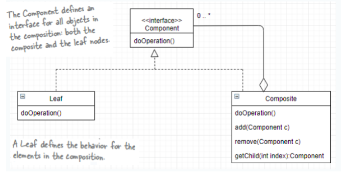
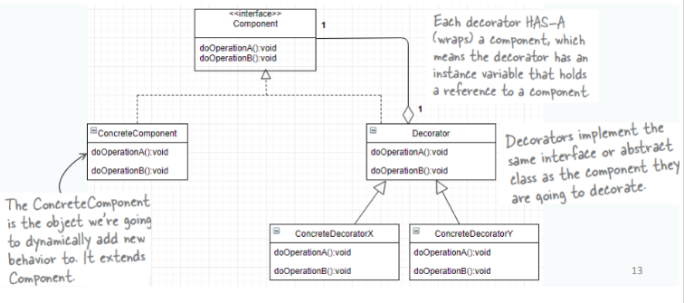
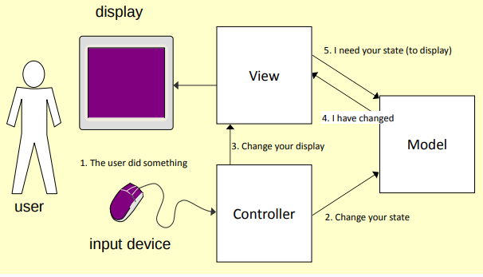

# Tutorial 8

## Composite Pattern

Composite pattern is useful when you have a structure like tree, and have components, and you want to treat it as a single object.

Example: File directories
- Directories composed of files and directories
- Printing a directory requires printing the sub-directories

Components:
- Component Interface
- Leaf - primitive object
- Composite - collection of primitive objects

## Decorator Pattern

To extend (decorate), the functionality of an object statically or dynamically.

Example: from lecture slides

### vs Composite Pattern
- Composite aggregates 0 to many Component
- Decorator aggregates 1 Component
- Composite pattern is for tree-like structure
- Decorator pattern is more like peeling layers of onion

## Observer Pattern

When certain objects need to be informed about changes in an object.

## Model View Controller

- Model: data, state  
- View: presentation layer
- Controller: connect the Model with View, takes in input and updates model and controls view
